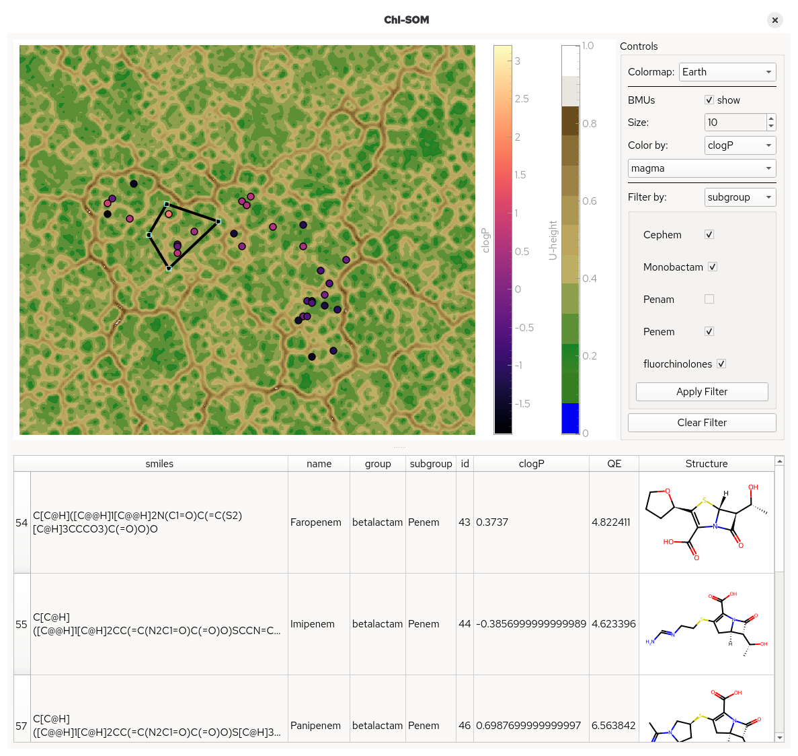

# The Viewer

The &#7521;-SOM viewer is an interactive Qt application for exploring a trained SOM: it draws the U-Matrix, overlays the best matching units (BMUs) of your datapoints, and lets you colour, filter, select and inspect those datapoints against the molecules behind them.



The viewer does **not** train SOMs. Train first with the library (see the [How-To Guides](how-to-guides.md)), save the U-Matrix and BMUs, then explore them here.

!!! note "Requires the `gui` extra and a display"
    Install with `pip install 'chi-som[gui]'`. The viewer needs a graphical display; on headless machines use [`plot_som`](how-to-guides.md#rendering-a-figure-without-a-display) instead. See [Limitations](limitations.md).

## Launching

### From the command line

Once a U-Matrix and the BMUs have been saved to disk, the viewer opens directly — no script needed:

```sh
chisom view -u umx.npy -b bmus.npy -d dataset.h5 --groups active --structure-column smiles
```

| Flag | Default | Purpose |
|---|---|---|
| `-u`, `--umatrix PATH` | – | U-Matrix of the SOM, as a `.npy` file (2D or 3D) |
| `-b`, `--bmus PATH` | – | BMU coordinates of the datapoints, as a `.npy` file of shape `(n, 2)` |
| `-d`, `--data PATH` | – | Datapoint properties (see formats below) |
| `--structure-column NAME` | auto-detected | Dataset column holding the SMILES used to render structures |
| `--groups GROUP [GROUP ...]` | all groups | HDF5 only: which groups of the store to load. Requires `-d` |
| `--scaling-factor N` | `3` | Interpolate the U-Matrix by this factor for an anti-aliased view |

`chisom --version` prints the installed version.

**Every argument is optional.** A bare

```sh
chisom view
```

opens an empty window; U-Matrix, BMUs and dataset can then be loaded from the *File* menu.

Exit codes: `1` for a load error or a missing display, `2` if the GUI extra is not installed.

### From Python

```python
from chisom import start_chisom_viewer

start_chisom_viewer(umatrix, bmus, dataset, structure_info_column="smiles")
```

All arguments are optional here too, so `start_chisom_viewer()` opens the same empty window.

### Supported dataset formats

The `-d`/`--data` argument, the *File → Load data* dialog and `chisom.io.load_dataset` all accept:

| Format | Suffixes | Notes |
|---|---|---|
| HDF5 store | `.h5`, `.hdf5` | Created with `HDF5Creator`; carries per-column value types and group structure |
| Delimited text | `.csv` | Comma-separated |
| Delimited text | `.tsv`, `.txt` | Tab-separated |
| Parquet | `.parquet`, `.pq` | Needs `pyarrow`, included in the `gui` extra |

`--groups` applies to HDF5 stores only. HDF5 stores are the only format that records value types (`categorical`, `continuous`, `na`) explicitly; for the other formats the type of each column is inferred — see [Limitations](limitations.md).

## Window layout

The window is a vertical splitter, and the divider can be dragged to rebalance the two halves:

- **Top** — the map view: the U-Matrix image, the BMU scatter, two colorbars, and the *Controls* panel on the right.
- **Bottom** — the compound table, listing the datapoints you have selected on the map.

The title bar reflects what is currently loaded, e.g. `ChI-SOM - U-matrix: umx.npy, BMUs: bmus.npy, data: VDR.h5`.

## The map

The U-Matrix is drawn as an image with an aspect-locked view: drag to pan, scroll to zoom.

- **U-height colorbar** — to the right of the map, showing the U-Matrix scale.
- **Colormap** — the *Controls* combo lists every matplotlib colormap plus two custom ones: **Earth** (the default, a 13-step discrete land/water palette) and **Cyclic Green**.
- **Interpolation** — the map is interpolated by `--scaling-factor` (default `3`) for a smoother, anti-aliased image. This is a launch-time setting.

If a SOM was trained with `save_progress`, its U-Matrix has one layer per epoch; the viewer always shows the **last** layer.

## Colouring the BMUs

Each occupied map unit gets one dot. The *Controls* panel governs how they look:

- **show** — master visibility toggle for the BMU layer.
- **Size** — marker size, 1–200.
- **Color by** — the dataset column driving the colour. Columns typed `na` still appear in the table but are not offered here, and the fingerprint column is always excluded.

What appears below *Color by* depends on the column's type:

=== "Categorical columns"

    One row per category, each with a colour button. Pick your colours, then press **Set Colors** to apply them all at once. Choices are remembered per column, so switching columns back and forth does not lose them.

    Where several categories share a map unit, the **dominant category sets the hue and the marker's alpha encodes how dominant it is** — a solid dot is a pure unit, a faint one is a mixed unit. This makes boundary regions between classes visible at a glance.

=== "Continuous columns"

    A second colormap combo appears; choosing a colormap immediately recolours the BMUs and reveals a second colorbar labelled with the property name.

    Each unit is coloured by the **mean** of the property over the datapoints mapped to it. The scale is normalised over occupied units only, so empty regions of the map do not flatten the colour range.

## Filtering by data property

Below the colouring controls, *Filter by* narrows the view to a subset of your datapoints. Pick a column, set a condition, and press **Apply Filter**:

=== "Categorical columns"

    A checkbox per category, all ticked initially. Untick the ones you want hidden.

=== "Continuous columns"

    **Min** and **Max** spin boxes, pre-populated with the column's actual value range.

**Clear Filter** restores everything — all categories re-ticked, spin boxes reset to the full range.

A filter is a single per-datapoint mask, and it propagates to three places at once:

1. **The map** — a BMU dot disappears unless at least one of its datapoints passes the filter.
2. **Selection** — an ROI selection skips filtered-out molecules, even when they sit on a map unit shared with molecules that do pass.
3. **Colour** — BMU colours are recomputed over the surviving datapoints only, so category ratios and continuous means reflect the filtered subset rather than the whole dataset.

## Selecting datapoints

Selection uses a polygon region of interest:

- **Ctrl+click** on the map adds a vertex to the polygon. Each added point closes the shape and immediately updates the table below.
- **Click** without a modifier clears the ROI.

Every datapoint whose BMU falls inside the polygon is listed in the compound table, minus anything the active filter excludes.

## Inspecting a single unit

Hover the cursor over a BMU dot and hold it there for about a second: a popup lists every molecule mapped to that unit, one card each, with a rendered structure and all of that molecule's property values.

The popup is scrollable, so densely populated units are fully browsable. Moving off the dot gives you a short grace period to move the cursor onto the popup itself; leaving the popup closes it. When zoomed far out, several overlapping dots may be hovered at once and all of their molecules are shown.

Structures are only drawn if a structure column has been set — otherwise cards read *No structure*.

## The compound table

The lower panel lists the current selection.

- A **Structure** column is appended when a structure column is configured, rendering each molecule from its SMILES.
- **Right-click** for a context menu: *Copy Selection*, *Copy All*, *Save Selection*, *Save All*.
- **Ctrl+C** copies the current selection.
- Exports are **tab-separated** (`.tsv`). The rendered structure images are omitted from exported data.

## Exporting the map

**Right-click anywhere on the map** for its context menu. Alongside the view controls — *View All*, *X axis*, *Y axis*, *Mouse Mode* — it carries an **Export...** entry, which opens the export dialog.

The dialog has two parts: a tree on the left to choose *what* to export, and a format list on the right. Selecting the top-level entry exports the whole map view; selecting a single item exports just that item.

| Format | Use it for |
|---|---|
| **Image File (PNG, TIF, JPG, ...)** | Raster output at a chosen width and height — slides, reports, quick sharing |
| **Scalable Vector Graphics (SVG)** | Vector output that stays sharp at any size — publication figures, further editing |
| **Matplotlib Window** | Reopens the current data in a matplotlib figure, for tweaking beyond what the viewer offers |
| **CSV of original plot data** | The underlying numbers rather than a picture |

**Export** writes to a file; **Copy** puts the result straight on the clipboard.

Exports reflect exactly what is on screen — the current colormap, BMU colouring, marker size, zoom level and any active filter. Set the view up the way you want it first, then export.

!!! tip "Scripted or headless figures"
    This is the interactive path. For figures generated from a script, on a machine with no display, or in bulk, use [`plot_som`](how-to-guides.md#rendering-a-figure-without-a-display) instead.

## Loading data while the viewer is open

The *File* menu has three entries — **Load U-matrix**, **Load BMUs** and **Load data** — so artefacts can be swapped without restarting. U-Matrix and BMU dialogs expect `.npy` files.

Choosing a data file opens an options dialog:

- **Structure column** — guessed automatically (a column named exactly `smiles`, else the first name containing `smiles`), and overridable from a dropdown.
- **Groups** — for HDF5 stores, a checklist of the groups to load. At least one must be ticked.

Before anything is swapped in, the viewer validates the artefacts against each other and warns if they disagree — for instance when the BMU array describes a different number of datapoints than the dataset holds, or when a BMU coordinate falls outside the U-Matrix lattice. Your existing view is left untouched when validation fails.

Colormap, BMU marker size and the splitter proportions are preserved across reloads.

## What the viewer does not do

- **Train SOMs** — training is library-only.
- **Save or restore sessions** — colour choices and filters live only as long as the window.

See [Limitations](limitations.md) for the full list, including performance characteristics.
